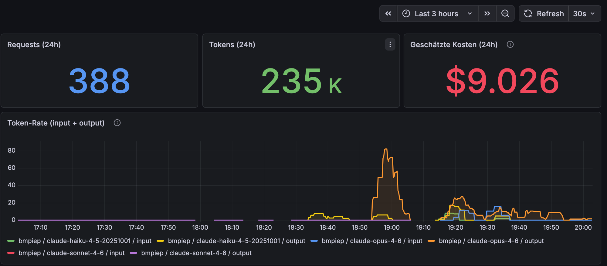
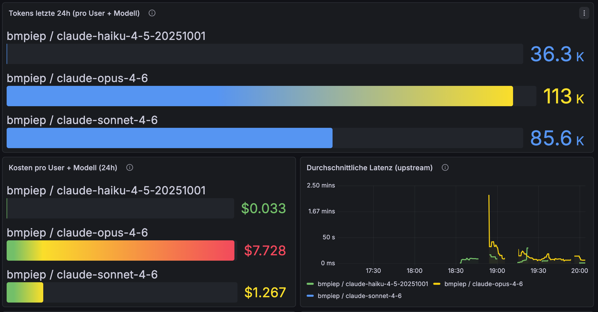
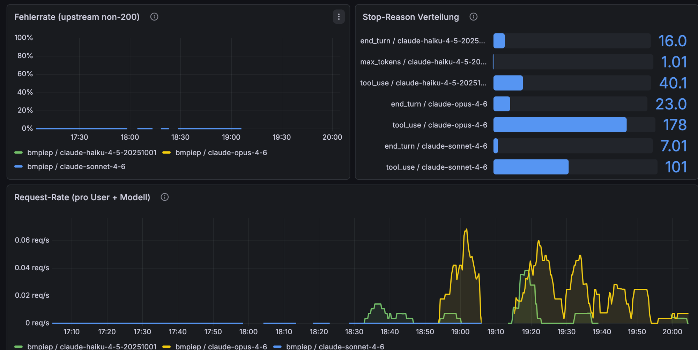

# gateii

A minimal, self-hosted proxy for the Anthropic Claude API.
Runs on any Docker host. No cloud, no signup, no SaaS.

```
Claude Code / your app
        |
        v
  gateii :8888   <-- token tracking, rate limiting, monitoring
        |
        v
  api.anthropic.com
```

---

## Why

You're paying for Claude and have no idea what's actually happening.
gateii fixes that.

| Problem | gateii answer |
|---------|---------------|
| No visibility into token usage | Per-user, per-model counters in Grafana dashboard |
| Sharing one API key is risky | Issue per-user proxy keys that pin their own upstream provider + credential |
| Don't want another SaaS | Self-hosted, stateless proxy, no external dependencies |
| Claude Max plan (OAuth) | `passthrough` mode -- your token forwarded as-is, no server key |

### Why no Redis?

Early versions used Redis for response caching, auth key storage, and metrics
counters. We removed it because:

- **Cache was useless**: Claude Code sends `stream: true` on every request --
  streaming bypasses the cache. Zero hits in practice.
- **Shared dicts are faster**: nginx shared memory has no network hop, no
  serialization overhead. Counters survive worker restarts.
- **Less moving parts**: 3 containers instead of 5. No Redis tuning, no
  persistence config, no connection pool management.
- **Prometheus is the real store**: Counter values in shared dicts don't need
  to survive container restarts -- Prometheus already has the time series.

---

## Quick start

```bash
# 1. Clone and configure
git clone https://github.com/bmmmm/gateii
cd gateii
cp .env.example .env        # edit PASSTHROUGH_USER if you want a name in the dashboard

# 2. Start
docker compose up -d

# 3. Tell Claude Code to use it
# Add to ~/.claude/settings.json -> env:
#   "ANTHROPIC_BASE_URL": "http://localhost:8888"

# 4. Open dashboard
open http://localhost:3001   # Grafana, no login required
```

That's it. Your existing Anthropic key (or Claude Max OAuth token) flows through unchanged.

---

## Modes

### passthrough -- Claude Max plan / own key

No API key stored on the server. gateii forwards whatever the client sends.

```
# .env
PROXY_MODE=passthrough
PASSTHROUGH_USER=alice     # shown in Grafana (optional)
```

Client settings (`~/.claude/settings.json`):
```json
{
  "env": {
    "ANTHROPIC_BASE_URL": "http://localhost:8888"
  }
}
```

Your Anthropic key stays where it is. gateii intercepts, tracks, and forwards.

### apikey -- shared team key

gateii holds one Anthropic key. Users get proxy keys from `admin.sh`.

```
# .env
PROXY_MODE=apikey
ANTHROPIC_API_KEY=sk-ant-...
```

```bash
# Issue a proxy key (each key pins one upstream provider + credential)
./scripts/admin.sh add alice \
    --provider anthropic \
    --upstream-key sk-ant-api03-...
# -> sk-proxy-4a7f...  (set as ANTHROPIC_API_KEY in client settings)
```

Client settings:
```json
{
  "env": {
    "ANTHROPIC_API_KEY": "sk-proxy-4a7f...",
    "ANTHROPIC_BASE_URL": "http://your-server:8888"
  }
}
```

Keys are stored in `data/keys.json` as structured entries (`{user, provider,
upstream_key, ...}`) — see [docs/keys.md](docs/keys.md) for schema and
migration from the old flat `{key: user}` format.

### Bootstrap handshake

Instead of copy-pasting `sk-proxy-...` keys over SSH/Slack, the admin issues a
one-time code + HMAC secret; the client runs `scripts/gateii-connect.sh` and
self-installs over a challenge → exchange → confirm protocol.

```bash
./scripts/admin.sh bootstrap create \
    --user alice \
    --provider anthropic \
    --upstream-key sk-ant-api03-...
```

Auto-revokes if the client never confirms. See
[docs/bootstrap.md](docs/bootstrap.md) for the protocol and security model.

---

## Monitoring

Grafana at `http://localhost:3001` -- no login, dashboard auto-provisioned.







### Metrics

| Metric | Labels | What it tells you |
|--------|--------|-------------------|
| `gateii_tokens_total` | user, provider, model, type | Input/output tokens consumed |
| `gateii_cost_dollars_total` | user, provider, model, type | Estimated cost (active provider pricing) |
| `gateii_requests_total` | user, provider, model | Request count |
| `gateii_request_duration_ms_total` | user, provider, model | Cumulative latency (/ requests = avg) |
| `gateii_upstream_errors_total` | user, provider, model | Non-200 upstream responses |
| `gateii_stop_reason_total` | user, provider, model, reason | end_turn / max_tokens / tool_use |
| `gateii_user_blocked` | user | 1 if user is currently blocked |

Prometheus scrape endpoint: `http://localhost:8888/metrics`

The console plugin queries Prometheus via a reverse proxy at `/internal/prometheus/` (restricted to localhost and Docker network). This avoids CORS issues when the browser fetches historical data directly.

`/internal/admin/openrouter-models` proxies the OpenRouter model API (`?order=top-weekly&categories=programming`) with a 12 h cache — used by the console to populate the live comparison panel. Pricing data sourced from [simonw/llm-prices](https://github.com/simonw/llm-prices).

`/internal/admin/health` returns component reachability — proxy, Prometheus, Grafana (parallel checks), and upstream error rate from counters. Used by the console health bar.

---

## Proxy routing

```bash
./scripts/admin.sh switch local    # route Claude Code through the local proxy (checks health first)
./scripts/admin.sh switch nutc     # route through the remote NUTC proxy (NUTC_URL in .env)
./scripts/admin.sh switch direct   # route directly to Anthropic (safe to stop proxy after)
./scripts/admin.sh switch status   # show the current ANTHROPIC_BASE_URL
```

**Important**: Always `switch direct` before stopping the proxy, or Claude Code loses its connection.

**Safe dev workflow** — when editing Lua or nginx config, switch to direct first:
```bash
./scripts/admin.sh switch direct   # 1. go direct — Claude Code stays connected
# edit, reload: docker exec gateii-proxy openresty -s reload
./scripts/admin.sh switch local    # 2. back to proxy when done
```

**Emergency recovery** — if the proxy breaks and Claude Code is cut off:
```bash
gateii-rescue   # global alias: switch direct + restart proxy container
# then restart Claude Code
```
Or directly: `./scripts/rescue.sh` (no dependencies beyond python3 and Docker).

## Key management

```bash
./scripts/admin.sh status          # key count, blocked users
./scripts/admin.sh keys            # all keys, masked
./scripts/admin.sh add alice --provider anthropic --upstream-key sk-ant-...
./scripts/admin.sh revoke sk-proxy-...
./scripts/admin.sh rotate alice    # new key, revoke all old ones
```

### Blocking and limits

```bash
./scripts/admin.sh block alice 86400    # block for 1 day
./scripts/admin.sh unblock alice
./scripts/admin.sh limit alice tokens_per_day 1000000
./scripts/admin.sh limits alice         # show today's usage
```

---

## Plugins

Plugins are opt-in features managed via `admin.sh plugin`:

```bash
./scripts/admin.sh plugin list              # show all plugins + status
./scripts/admin.sh plugin enable <name>     # activate a plugin
./scripts/admin.sh plugin disable <name>    # deactivate a plugin
./scripts/admin.sh plugin status            # detailed status
```

| Plugin | What it does | Enable |
|--------|-------------|--------|
| `console` | Admin web console at `/console` -- key management, limits, usage bars, live stats, live pricing comparison (llm-prices.com), monthly cost forecast | `admin.sh plugin enable console` |
| `git-tracking` | Track git activity (commits, lines changed) alongside token usage | `admin.sh plugin enable git-tracking ~/projects ~/servers` |

**console** sets `CONSOLE_ENABLED=1` in `.env` and restarts the proxy. No extra container needed.

**git-tracking** runs as a separate container (Docker Compose profile). It scans mounted repo paths and writes Prometheus metrics to `/data/git-metrics.txt`.

Both plugins can be toggled independently without affecting the proxy or each other.

---

## Stack

| Container | Image | Port | Role |
|-----------|-------|------|------|
| `gateii-proxy` | `openresty/openresty:alpine` | 8888 | nginx + LuaJIT proxy + metrics |
| `gateii-prometheus` | `prom/prometheus` | 9090 | metrics storage |
| `gateii-grafana` | `grafana/grafana` | 3001 | dashboard |
| `gateii-git-tracking` | `alpine` _(plugin)_ | -- | git activity metrics (optional) |

All runtime state lives in nginx shared memory. Prometheus stores the time series.

### Vendored Lua libraries

These are included in `config/openresty/lua/resty/` because they're not in the `openresty:alpine` base image:

| Library | Purpose |
|---------|---------|
| `lua-resty-http` | HTTPS upstream requests + streaming |
| `lua-resty-string` | Hex encoding (used internally by lua-resty-http) |

---

## Configuration

All configuration via `.env`:

| Variable | Default | Description |
|----------|---------|-------------|
| `PROXY_MODE` | `passthrough` | `passthrough` or `apikey` |
| `PASSTHROUGH_USER` | _(key suffix)_ | Display name in passthrough mode |
| `ANTHROPIC_API_KEY` | -- | Required when `PROXY_MODE=apikey` |
| `CONSOLE_ENABLED` | `0` | `1` = enable admin console at `/console` |
| `HISTORY_RETENTION` | _(unlimited)_ | Prometheus retention: `30d`, `90d`, `180d`, `365d`, or empty for unlimited |
| `GIT_AUTHOR` | -- | Filter git-tracking by author name (optional) |
| `GIT_TRACKING_INTERVAL` | `300` | git-tracking refresh interval in seconds |

---

## Pricing configuration

Cost metrics are driven by `config/openresty/lua/providers.json`:

```json
{
  "active_provider": "anthropic",
  "providers": [
    {
      "id": "anthropic",
      "name": "Anthropic (Direct API)",
      "url": "https://www.anthropic.com/pricing",
      "cache_write_multiplier": 1.25,
      "cache_read_multiplier": 0.1,
      "models": [
        { "pattern": "opus",   "name": "Claude Opus 4",    "input": 5.0, "output": 25.0 },
        { "pattern": "sonnet", "name": "Claude Sonnet 4",  "input": 3.0, "output": 15.0 },
        { "pattern": "haiku",  "name": "Claude Haiku 4.5", "input": 1.0, "output": 5.0  }
      ]
    }
  ],
  "comparison_models": [
    { "openrouter_id": "anthropic/claude-sonnet-4-6", "name": "Claude Sonnet 4.6",
      "vendor": "Anthropic", "or_rank": 6, "input": 3.0, "output": 15.0 },
    ...
  ]
}
```

- `active_provider` selects which entry drives `gateii_cost_dollars_total`.
- `cache_write_multiplier` / `cache_read_multiplier` apply to Anthropic prompt-caching tokens.
- `comparison_models` is the **static fallback** for the console comparison panel. At runtime the console fetches the current top-10 weekly programming models from OpenRouter (`/internal/admin/openrouter-models`, 12 h cache) and replaces this list dynamically. Each entry has an `openrouter_id` for live price lookup and an `or_rank` for the weekly position badge.

After editing `providers.json`, reload nginx: `docker exec gateii-proxy openresty -s reload`

---

## Adding a provider

1. Create `config/openresty/lua/providers/myprovider.lua`:

```lua
local cjson = require "cjson.safe"
local _M = {}

_M.upstream_url = "https://api.example.com"

function _M.build_headers(upstream_key, auth_type)
    return {
        ["Content-Type"]  = "application/json",
        ["Authorization"] = "Bearer " .. (upstream_key or ""),
    }
end

-- Returns: input_tokens, output_tokens, stop_reason
function _M.extract_tokens(body)
    local obj = cjson.decode(body)
    if not obj or not obj.usage then return 0, 0, nil end
    return obj.usage.input_tokens or 0, obj.usage.output_tokens or 0, obj.stop_reason
end

return _M
```

2. Register in `config/openresty/lua/providers/init.lua`:

```lua
providers["myprovider"] = require("providers.myprovider")
```

3. Add the env var to `.env` and `docker-compose.yml` if needed, redeploy.

---

## Admin API & Console

The admin surface at `/internal/admin/*` accepts two auth mechanisms:

- **Session cookie** — `POST /internal/admin/login` with `{token}` sets
  `admin_session=<hex>; HttpOnly; Secure; SameSite=Strict` (1 h TTL). Used by
  the `/console` web UI.
- **Header** — `X-Admin-Token: <ADMIN_TOKEN>`. Used by `admin.sh` and curl.

Set `ADMIN_TOKEN` (≥ 32 random hex bytes) in `.env` for production. Without
it, login returns 503 and the IP allow-list (`127.0.0.1` + Docker bridge) is
the only wall. Full endpoint reference: [docs/admin-api.md](docs/admin-api.md).

---

## Security notes

| Topic | Status |
|-------|--------|
| SSL verification | Enabled -- `ca-certificates` installed at container startup |
| Auth cache TTL | Revoked keys work for up to 5 min -- reduce in `auth.lua` if needed |
| Request size limit | 10 MB max body (supports vision payloads) -- set in `nginx.conf` |
| Admin API | Internal only -- IP allow-list + `ADMIN_TOKEN` (cookie or header) |
| Admin session | HttpOnly, Secure, SameSite=Strict cookie; crypto-random id; 1 h TTL |
| Console CSP | `script-src 'self' 'nonce-<N>'` — no inline scripts without per-request nonce |
| Bootstrap handshake | HMAC-SHA256, constant-time proof compare, one-time code, auto-revoke on failed install |

---

## License

[GPL-3.0](LICENSE)
